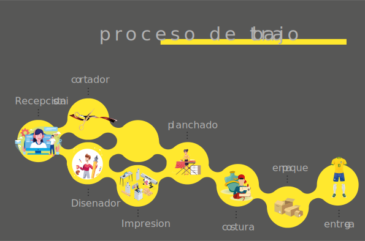

Edgar Joseph Rivero Matheus v-20428267

# Mecanismo de trabajo de una Sublimadora

>¿Qué es la sublimación de camisetas?
La técnica de sublimación en camisetas, se emplea para estampar diseños personalizados con mayor calidad, que la técnica de la Serigrafía. Esta técnica consiste en imprimir mediante un plotter o impresora de tinta, el diseño escogido en un papel absorbente especial para este tipo de estampados. [un video que explica el proceso]: https://www.youtube.com/watch?v=HO-SGmURJrU

En el trabajo operativo diario en una sublimadora se presentan varios puntos
complejos de trabajo ya que existen varios grupos de trabajo donde cada uno cumple
un rol importante en el desarrollo de la prenda final, el proceso comienza con la
recepcionista (la persona que atiende el cliente), luego pasa al disenador quien
disena la prenda y se procesede a la impresion del papel que sera planchado con la
tela pero en paralelo se esta cortando la tela para luego pasarla a planchar y pasarla
al area de costura en este preceso al no tener un buen plan de trabajo todo se
cometen muchos errores de prendas faltantes o duplicadas entre otros.

## En este punto nos preguntamos

- Como mejorar los tiempos de trabajo? 
Como cumplir con los pedidos sin tantos errores? 
- Cual seria la cantidad necesaria de empleados para este proceso (teniendo en cuenta la maquinaria que se tiene)?
- Cuantas horas diarias serian necesarias para cada empleado para poder cumplir con el trabajo y cometer los minimos errores? 
- Como maximizar ganancias?

En estas preguntas encontramos la complejidad con la que tendremos que trabajar

## Para poder encontrar las fallas y poder apreciar mejor el proceso se procede a simular un ambiente virtual, vamos a poder tener una idea de las tareas diarias que se procesan y como mejorar el metodo de trabajo

Para ejecutar la simulacion del proceso entre a [simulador]: https://www.bpsimulator.com/run/ y abra el archivo [simulacion de la sublimadora.json ] y luego en play

Se les vera algo como esto

Para iniciar la simulacion le damos click en play

Al darle doble click sobre cualquier area de trabajo se pueden ver los detalles de las tareas 

# Con la ayuda de la simulacion podemos responder los interrogantes

Resutados obtenidos

Como mejorar los tiempos de trabajo? 
Con la ayuda de los resultados de la simulacion nos damos cuenta que se necesitaria otro disenador para mejorar tiempos ya que uno solo solo logra hacer al dia 2 tareas mientras que en otras areas 

Como cumplir con los pedidos sin tantos errores?
Esta pregunta fue agregada especialmente para tener claro que no todas las interrogantes se pueden responder con la simulacion y no tiene nada de malo solo son aspectos a tener en cuenta

Cual seria la cantidad necesaria de empleados para este proceso (teniendo en cuenta la maquinaria que se tiene)?
1 disenadores, 3 costureras y 1 cortadores y un recepcionista

Cuantas horas diarias serian necesarias para cada empleado para poder cumplir con el trabajo y cometer los minimos errores?
Con 8 horas diarias se puede mantener un buen progreso

Como maximizar ganancias?
con contratar un nuevo disenador(a) se puede maximizar las ganancias 

